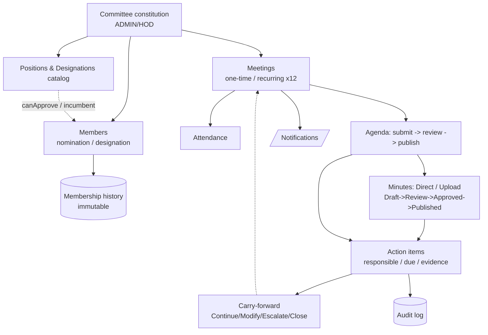
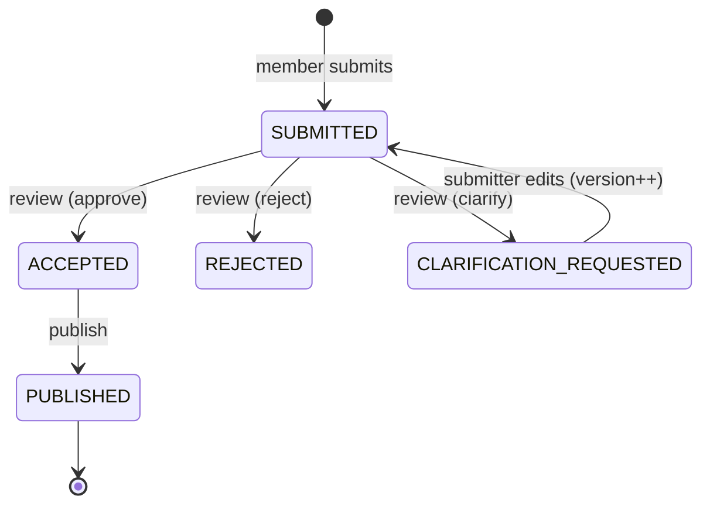
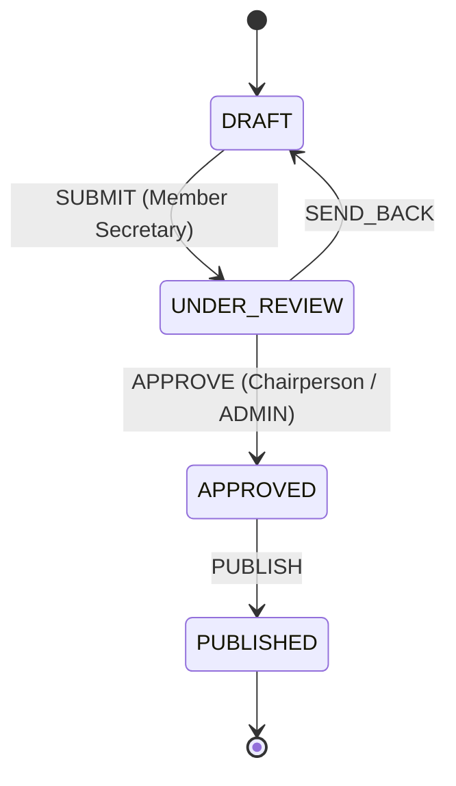
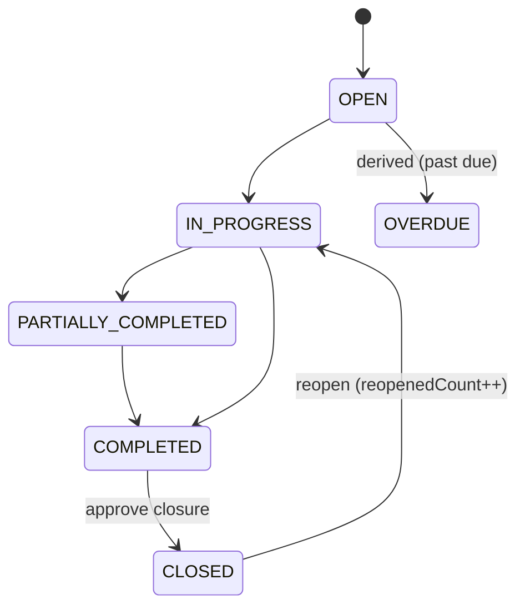

# Committee Management — Flow Diagrams

> Companion to [committee-module-plan.md](committee-module-plan.md). Reflects the implemented core lifecycle (Phases 0–5 + dashboard widgets).

---

## 1. End-to-end lifecycle

```
                          ┌─────────────────────────────┐
                          │   COMMITTEE CONSTITUTION     │  Roles: ADMIN / HOD
                          │  name·category·frequency·    │
                          │  effective/expiry·status     │
                          └──────────────┬──────────────┘
                                         │
                  ┌──────────────────────┼──────────────────────┐
                  ▼                                              ▼
      ┌───────────────────────┐                    ┌─────────────────────────┐
      │   MEMBERS             │                     │  POSITIONS & DESIGNATIONS│
      │  • Nomination (user)  │◄────resolves────────│  catalog (canApprove)    │
      │  • Designation(incumb)│   incumbent from    │  designations (incumbent)│
      └───────────┬───────────┘   active users      └─────────────────────────┘
                  │  every add/remove/replace/role-change
                  ▼
      ┌───────────────────────┐
      │ MEMBERSHIP HISTORY     │  immutable · ADDED/REMOVED/REPLACED/ROLE_CHANGED
      └───────────────────────┘
                  │
                  ▼
      ┌───────────────────────────────────────────────┐
      │   MEETINGS   (one-time  |  recurring ×12 horizon)│  → notify members
      │   SCHEDULED → RESCHEDULED / CANCELLED / COMPLETED│
      └───────────┬───────────────────────────────────┘
                  │
       ┌──────────┼───────────────────────────────┐
       ▼          ▼                                ▼
 ┌───────────┐ ┌──────────────────┐      ┌─────────────────────┐
 │ATTENDANCE │ │   AGENDA          │      │   MINUTES (MoM)      │
 │present/   │ │  submit→review→   │─────▶│  Direct entries OR   │
 │absent/... │ │  publish          │ per  │  Uploaded document   │
 └───────────┘ └──────────────────┘ item └──────────┬──────────┘
                                                     │
                                                     ▼
                          ┌────────────────────────────────────────┐
                          │   ACTION ITEMS                          │
                          │  source: agenda/audit/incident/decision │
                          │  responsible · due · priority · evidence│
                          └──────────────┬─────────────────────────┘
                                         │ pending at next meeting
                                         ▼
                          ┌────────────────────────────────────────┐
                          │   CARRY-FORWARD                         │
                          │  Continue / Modify-due / Escalate / Close│
                          └────────────────────────────────────────┘

   Every box above ──▶ AUDIT LOG (immutable)  +  NOTIFICATIONS (live + email)
```

---

## 2. Agenda state machine (FRS §5)

```
            submit                review (Chair/Secretary or ADMIN)
  member ──────────▶ SUBMITTED ──┬──────────────▶ ACCEPTED ──┐
                        ▲        │                            │ publish
        edit (resets)   │        ├──────────────▶ REJECTED    ▼
                        │        │                         PUBLISHED  (locked)
                        └────────┴──▶ CLARIFICATION_REQUESTED
                          (submitter edits → version++ → back to SUBMITTED)
```

---

## 3. Minutes approval workflow (FRS §7.3)

```
   Member Secretary (ADMIN/HOD)        Chairperson (canApprove / ADMIN)
   ──────────────────────────────     ─────────────────────────────────
        edit/save                          approve            publish
   DRAFT ─────────▶ DRAFT ── SUBMIT ─▶ UNDER_REVIEW ─▶ APPROVED ─▶ PUBLISHED
     ▲                                      │
     └──────────────── SEND_BACK ───────────┘
```

---

## 4. Action item lifecycle (FRS §8–9)

```
                    progress (responsible person or manager)
   OPEN ─▶ IN_PROGRESS ─▶ PARTIALLY_COMPLETED ─▶ COMPLETED
     │                                               │  approve closure
     │  (dueDate < today & not done)                 ▼  (Chair/Secretary/ADMIN)
     └────────── derived: OVERDUE                  CLOSED
                                                     │ reopen (reopenedCount++)
                                                     └──────▶ IN_PROGRESS

   Carry-forward decision on a pending item:
     CONTINUE · MODIFY_DUE_DATE · ESCALATE(priority↑) · CLOSE
```

---

## 5. Authorization model (cuts across all flows)

```
  Coarse  →  @Roles guard:  ADMIN / HOD  (writes)   ·  any authenticated (reads)
  Fine    →  position-gate:  member with positionType.canApprove   (ADMIN overrides)
             applies to: agenda review/publish · minutes approve/publish ·
                         action close/reopen/carry-forward
```

---

## 6. Rendered diagram (Mermaid)



### Agenda state machine



### Minutes workflow



### Action item lifecycle


